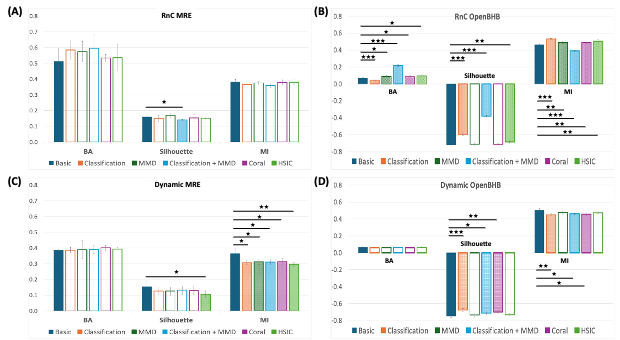

<p align="right">
  
</p>


# Addressing Confounding Variables in Brain Age Prediction Through Domain-Invariant Contrastive Learning Approaches


This repository explores domain adaptation for reducing scanner site confounding in contrastive learning–based brain age prediction. Using MRI and MRE data, multiple confound removal methods are evaluated with both embedding-level metrics and downstream age prediction. Results reveal a trade-off between confound mitigation and predictive performance, emphasizing the need for multi-metric evaluation.

This work was carried out as part of a research project at the University Of Cambridge.




## Running 

### Training

The code can be found in the src folder. For training: 

- `main_infonce.py`: for training models with contrastive losses 

For easiness of use, the script `launcher.py` is provided with some predefined experiments which can be found in `src/exp` as YAML template. To launch: 

```
python3 launcher.py exp/mae.yaml
```


## References

This work builds upon:

- Barbano, C. A., Dufumier, B., Duchesnay, E., Grangetto, M., & Gori, P.  
  *Contrastive learning for regression in multi-site brain age prediction.*  
  International Symposium on Biomedical Imaging (ISBI), 2023.